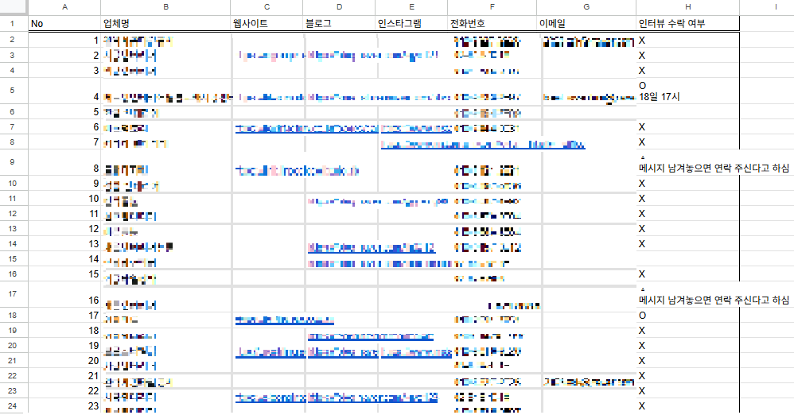

평소에 생각을 잘 드러내지 않는 편입니다. 인터넷상에 글을 올린다는 것은 상상해 본 적도 없습니다. 하지만 20대 들어 가장 압축적이었던 25년 1분기의 경험은 이런 저를 되돌아보게 만들었습니다. 그렇게 생애 첫 글을 작성하게 되었습니다.

내 생각을 표현하고 기록하는 것에 인색한 이유는 여러가지가 있습니다. 우선 미래의 나 자신에게 떳떳하지 못하리라 생각하기 때문입니다. 어린 마음에 절대적으로 옳다고 여겼던 편협한 생각들을 되돌아보며 멋쩍게 반성했던 경험들이 많습니다. 지금 역시 흔들리지 않는 기준을 가지고 삶을 대하고자 하지만 훗날 저에게 부끄러운 과거로 비춰질 지 모른다는 걱정에 생각을 표현하는 것을 조심해 왔습니다.

또 다른 이유로는 타고난 성향도 있습니다. 경계심이 풀리기 전까지는 진짜 나 자신을 드러내지 않고자 합니다. 그리고 저는 그러한 자기 개방을 일종의 약점을 공개와도 같이 여깁니다. 공감을 얻지 못할지도 모르지만 타고난 성격인 탓에 품고 살아가야 할 제 일부분입니다. 그 외에도 다양한 이유로 진정한 나 자신을 숨기며 살아왔습니다. 하지만 최근 몇 달 간의 경험은 새로웠습니다.

왜 굳이 사서 고생을 하냐는 말을 듣기도 했지만, 최근 저는 극 초기 창업자와 일을 함께 했습니다. 원래부터 창업을 꿈꿔왔던 것은 아니었습니다. 운 좋게 갖게된 1년여의 기간 동안 할 수 있는 경험 중에 유일하게 다시는 하지 못 할 일이라고 생각했기 때문에 시작한 일입니다. 예상대로 과정은 순탄치 않았습니다. 시장 타이밍이 중요함을 깨닫고 애지중지 개발했던 초기 아이템을 포기하였습니다. 시장 조사를 위해 수 많은 전화를 돌렸고 여의치 않을 때는 직접 돌아다니기도 했지만 문전박대를 당하기 일쑤였습니다. 하루 종일 발품을 팔아 여러 가게의 문을 두드렸지만 인터뷰가 몇 건 성사되지 않아 허탈했던 날도 있었습니다.

그러던 중 개인 블로그를 운영하며 다수의 글을 써온 분과 이야기를 나눌 기회가 있었습니다. 본인의 생각을 기록하는 데 있어 갖는 조심스러움은 저와 궤를 같이 하는 분이셨지만 그럼에도 그 분께서는 행동을 피하지 않았습니다. 진정한 자기 자신을 숨기려고 할 필요가 없다는 생각, 당시 기억을 되살릴 수 있는 이정표로써의 가치, 미숙했던 과거의 나를 돌아보는 과정에서 얻는 깨달음 등을 듣고 많은 생각이 들었습니다. 바로 테크 관련 공부한 것을 블로그에 영어로 정리하기 시작했습니다. 생각을 표현하는 것 보다는 부담이 적었고, 영어권 커뮤니티와 소통하고 싶었기 때문입니다. 그리고 이제는 개인적인 이야기도 적고자 합니다.

앞으로 매 달, 혹은 매 분기마다 기록을 남기고자 합니다. 여전히 제 생각을 가감없이 적지는 못할 것 같습니다. 하지만 대외적인 형식으로나마 진행할 계획입니다. 개발 생산성을 위해 AI EDITOR 유료 버전까지 사용하고 있을 만큼 생성형 AI의 도움을 많이 받습니다. 하지만 제 기록에 있어서 만큼은 직접 기록합니다. 비문이나 오타등으로 완벽하지 않은 글이 될 지도 모르지만 그것 까지도 기록의 일부라고 생각합니다. 그리고 철저하게 경어체를 사용하려고 합니다. 공개적인 글에서 갖추는 최소한의 예의이기도 하고, 회고 과정에서 오는 부끄러움을 조금이라도 줄이고자 위함이기도 합니다.

기본과 꾸준함이 가장 어려운 부분입니다. 이러한 자기 기록 역시 기본과 꾸준함을 놓치지 않도록 노력하겠습니다.